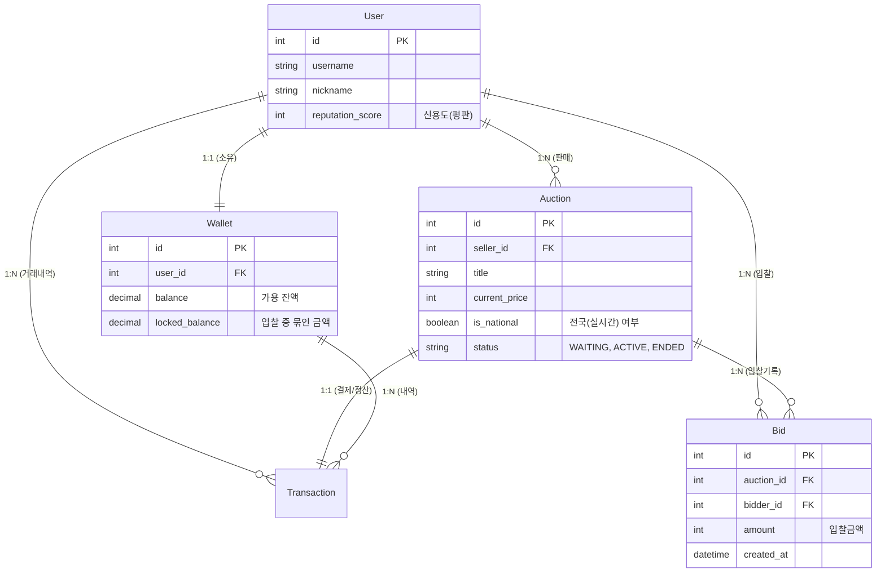

# [Database] 데이터 무결성을 위한 경매 시스템 DB 설계 전략

> 이 문서는 A1_NeighborBid_Auction 프로젝트의 데이터베이스 설계 철학과 핵심 엔티티(Entity) 간의 관계, 그리고 금융 거래의 무결성을 지키기 위한 필드 설계에 대해 상세히 기술합니다.

## 1. 개요: 신뢰할 수 있는 거래 장부 만들기

경매 시스템은 단순한 게시판과 달리 **'자산(돈과 물건)'**이 이동하는 금융 시스템의 성격을 띱니다. 따라서 데이터베이스 설계 단계에서 가장 중요하게 고려한 가치는 **정합성(Consistency)**과 **무결성(Integrity)**입니다.

저희 팀은 `SQLite3`를 메인 저장소로 채택하여 트랜잭션 안전성을 확보했습니다. (추후 운영 환경에서는 `PostgreSQL`로 마이그레이션 예정)
실시간성이 필요한 데이터와 영구히 보존해야 할 데이터를 명확히 구분하여 스키마를 설계했습니다.

---

## 2. ERD (Entity Relationship Diagram)

다음은 시스템의 중추적인 역할을 하는 핵심 모델들의 관계도입니다. `User`를 중심으로 `Wallet`, `Auction`, `Bid`가 유기적으로 연결되어 있습니다.



---

## 3. 핵심 설계 포인트 Deep Dive

단순한 테이블 구조 같아 보이지만, 그 내부에는 동시성 이슈와 데이터 무결성을 해결하기 위한 치열한 고민이 담겨 있습니다.

### 3.1. Wallet 모델의 이중 장부 시스템 (`balance` vs `locked_balance`)

가장 큰 고민은 **"사용자가 입찰은 햇지만 아직 낙찰받지 못한 돈을 어떻게 처리할 것인가?"** 였습니다.

*   **문제 상황:** 사용자가 10,000원을 가지고 경매 A에 10,000원을 입찰했습니다. 아직 경매는 안 끝났습니다. 이 때 사용자가 경매 B에 또 10,000원을 입찰한다면?
*   **해결책 (`locked_balance`):** `balance`에서 돈을 바로 차감하지 않고 삭제해버리면 나중에 유찰되었을 때 기록이 복잡해집니다. 따라서 **'가용 잔액(balance)'**과 **'잠긴 잔액(locked_balance)'**으로 필드를 분리했습니다.

```python
# wallet/models.py
class Wallet(models.Model):
    # 실제 쓸 수 있는 돈
    balance = models.DecimalField(max_digits=12, decimal_places=0, default=0)
    
    # 입찰 중이라 '내 돈이지만 쓸 수 없는' 돈 (이중 지출 방지 핵심)
    locked_balance = models.DecimalField(max_digits=12, decimal_places=0, default=0)
```

이 설계를 통해 시스템은 언제나 `총 자산 = balance + locked_balance`라는 불변의 공식을 유지할 수 있으며, 이중 입찰 시도를 원천 봉쇄할 수 있었습니다.

### 3.2. Auction 모델의 `is_national` (하이브리드 아키텍처 지원)

초기 기획은 "모든 경매가 실시간"이었습니다. 하지만 당근마켓 같은 동네 직거래(중고 거래) 비중이 커지면서, **"굳이 모든 거래에 비싼 웹소켓 비용을 지불해야 할까?"** 라는 의문이 들었습니다.

*   **전략:** 데이터베이스 컬럼 하나로 시스템 동작 모드를 완전히 분리하는 **하이브리드 전략**을 택했습니다.

```python
# auctions/models.py
class Auction(models.Model):
    # True -> Redis & WebSocket 엔진 사용 (전국 실시간 경매)
    # False -> 단순 DB 트랜잭션 사용 (일반 동네 경매)
    is_national = models.BooleanField(default=False)
```

이 플래그(`boolean`) 하나 덕분에 백엔드 로직은 `if auction.is_national:` 분기문 하나로 거대한 두 아키텍처(HTTP vs WebSocket)를 유연하게 오갈 수 있게 되었습니다.

### 3.3. Transaction 모델의 불변성 (Immutability)

금융 거래 내역은 절대 수정되어서는 안 됩니다. 따라서 `Transaction` 모델은 `UPDATE`가 발생하지 않는 **Insert-Only** 정책을 고수했습니다.

*   환불 발생 시: 기존 내역을 지우는 것이 아니라, `BID_REFUND`라는 새로운 타입의 **상쇄 트랜잭션(Compensating Transaction)**을 생성하여 기록을 남깁니다.
*   이를 통해 추후 CS 이슈 발생 시 자금의 정확한 흐름을 역추적할 수 있습니다.

---

## 4. 인덱싱 및 성능 최적화 전략 (추후 계획)

현재는 초기 단계이기에 기본 PK 인덱스만 사용하고 있지만, 향후 데이터가 수천만 건으로 늘어날 것을 대비해 다음과 같은 인덱싱 전략을 수립해 두었습니다.

1.  **경매 조회 최적화:** `Auction` 테이블의 `status`와 `end_time` 복합 인덱스
    *   `CREATE INDEX idx_active_auction ON auction (status, end_time);` (진행 중인 경매 중 곧 끝나는 순 조회)
2.  **입찰 내역 조회:** `Bid` 테이블의 `auction_id`와 `amount` 복합 인덱스
    *   `CREATE INDEX idx_bid_ranking ON bid (auction_id, amount DESC);` (특정 경매의 현재 1등 입찰자 초고속 조회)

---

## 5. 결론

데이터베이스는 애플리케이션의 뼈대입니다. 화려한 기능도 중요하지만, **"돈은 절대 틀리면 안 된다"**는 대원칙 아래 설계된 이 스키마는 서비스의 신뢰성을 지탱하는 가장 든든한 버팀목이 되었습니다.

> **작성자:** A1_NeighborBid_Auction 백엔드 개발팀
> **관련 문서:** [02_CORE_LOGIC_ANALYSIS.md](file:///c:/A1_NeighborBid_Auction/02_CORE_LOGIC_ANALYSIS.md)
