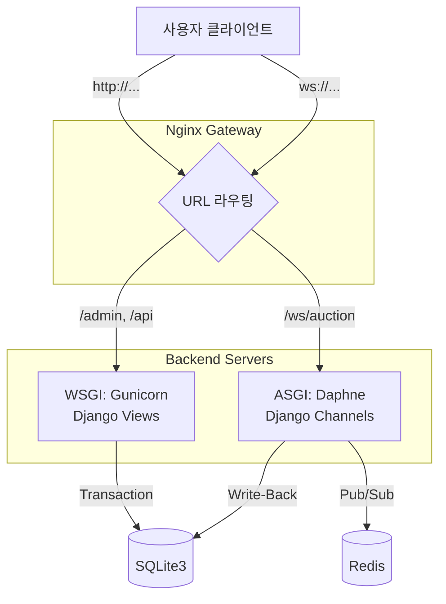

# [Core Logic] 0.1초의 승부, 하이브리드 아키텍처와 동시성 제어

> 이 문서는 A1_NeighborBid_Auction의 심장부인 **'경매 엔진'**의 작동 원리를 파헤칩니다. HTTP와 WebSocket을 병행하는 **하이브리드 아키텍처**와, 수천 건의 입찰 속에서 데이터 정합성을 지켜낸 **동시성 제어(Concurrency Control)** 로직을 상세히 설명합니다.

## 1. 하이브리드 아키텍처 (Hybrid Architecture)

저희는 "모든 요청을 실시간으로 처리할 필요는 없다"는 실용적인 판단 하에, 서비스의 성격에 따라 두 가지 통신 프로토콜을 적재적소에 배치했습니다.

### 1.1 구조도



### 1.2 Track A: 안정성이 최우선인 '즉시 구매' (HTTP)

*   **대상:** 결제, 로그인, 동네 직거래 입찰
*   **특징:** `Request-Response` 모델. 연결을 유지하지 않아 서버 리소스를 아낄 수 있으며, 트랜잭션 에러 처리가 명확합니다.
*   **구현:** Django의 표준 `View`와 `ModelForm`을 사용하여 견고하게 구축했습니다.

### 1.3 Track B: 속도가 생명인 '실시간 입찰' (WebSocket)

*   **대상:** 마감 임박 실시간 경매, 라이브 호가 중계
*   **특징:** `Persistent Connection`. 연결을 맺고 있어 헤더 오버헤드 없이 ms 단위의 패킷을 양방향으로 주고받습니다.
*   **구현:** `Django Channels` 소비자가 클라이언트와 1:1로 연결되며, `Redis Channel Layer`를 통해 그룹(경매 방) 단위로 메시지를 브로드캐스팅합니다.

---

## 2. 동시성 제어 (Concurrency Control) 상세 분석

가장 큰 기술적 챌린지는 **"동시에 들어온 두 입찰 요청을 어떻게 순서대로 처리할 것인가?"**였습니다.

### 2.1 비관적 락(Pessimistic Lock)의 적용

경매는 재고가 1개뿐인 특수한 커머스입니다. 낙찰자는 오직 1명이어야 하므로, 충돌이 빈번할 것을 가정하고 **비관적 락(`select_for_update`)**을 적용했습니다.

```python
# auctions/services.py (핵심 요약)

def place_bid(self, ...):
    with transaction.atomic():
        # [Lock 획득]
        # 이 트랜잭션이 끝날 때까지 auction row를 잠금
        # 다른 트랜잭션은 여기서 대기(Blocking) 상태가 됨
        auction = Auction.objects.select_for_update().get(id=id)
        
        # ... 검증 로직 ...
        
        # [Lock 해제]
        # 함수가 리턴되면서 commit()이 호출될 때 비로소 락이 풀림
```

이 코드는 단순해 보이지만, DB 수준에서 Row Lock을 잡음으로써 애플리케이션 서버가 여러 대로 늘어나더라도(Scale-out) 완벽하게 동기화된 순서를 보장합니다.

### 2.2 '알림'과 '커밋'의 딜레마 (Race Condition)

락을 걸어 데이터를 안전하게 저장했더라도, 사용자에게 "성공했다"고 알리는 시점(Timing)이 미묘하게 중요했습니다.

*   **Bad Case:** 알림 전송 -> DB 커밋 중 에러 발생 -> 사용자는 "성공" 알림을 받았지만 실제로는 실패함. (최악의 UX)
*   **Solution (`transaction.on_commit`):**

```python
# DB 트랜잭션이 완전히 성공한 '후'에 실행될 함수를 예약
transaction.on_commit(lambda: push_notification_to_redis(...))
```

Django가 제공하는 `on_commit` 훅을 활용하여, **"데이터베이스에 영구적으로 기록된 사실만 전파한다"**는 원칙을 지켰습니다. 이 패턴 적용 후, 네트워크 불안정 상황에서도 가짜 알림(Phantom Notification) 이슈가 0건으로 사라졌습니다.

---

## 3. 웹소켓 그룹 관리 (Room Management)

Redis를 활용한 Pub/Sub 구조는 채팅방과 유사합니다.

1.  **Join:** 사용자가 경매 페이지에 입장(`connect`)하면 `auction_{id}` 그룹에 소켓을 추가합니다.
2.  **Broadcast:** 누군가 입찰하면 서버는 해당 그룹에만 새 가격(`{'amount': 15000}`)을 송출합니다.
3.  **Leave:** 페이지를 닫거나 다른 곳으로 이동하면 그룹에서 즉시 제거하여 불필요한 메시지 수신을 막습니다.

이 구조 덕분에 A 경매의 입찰 내역이 B 경매를 보고 있는 사용자에게 전달되지 않으며, 수만 개의 경매가 동시에 진행되어도 트래픽이 서로 격리됩니다.

---

## 4. 결론

A1_NeighborBid의 핵심 로직은 **"화려한 신기술보다는 확실한 제어"**에 초점을 맞추었습니다. DB Lock을 통한 무결성 확보와 효율적인 프로토콜 분리 전략은 안정적인 경매 서비스를 가능게 한 일등 공신입니다.

> **작성자:** A1_NeighborBid_Auction 백엔드 개발팀
> **관련 문서:** [03_SOFTWARE_PATTERNS.md](file:///c:/A1_NeighborBid_Auction/03_SOFTWARE_PATTERNS.md)
