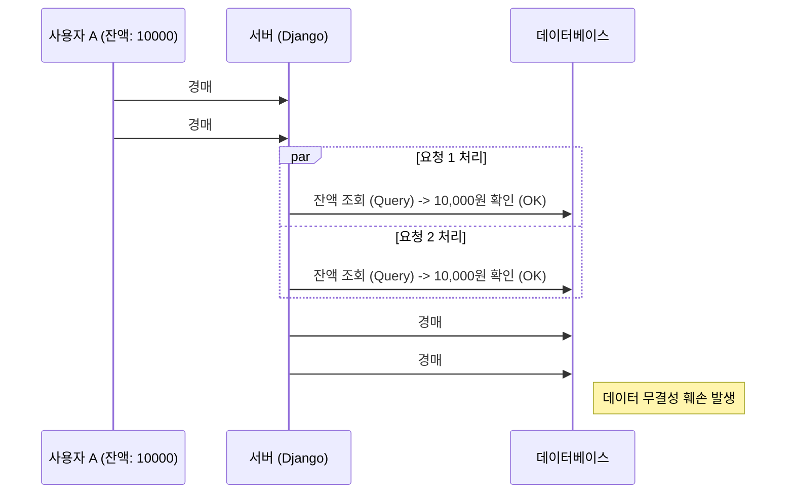

# [Backend] Django와 WebSocket을 활용한 실시간 경매 시스템의 동시성 제어 전략

> 이 글은 A1_neighborbid_Auction 프로젝트를 개발하며 마주한 **'동시성 이슈(Concurrency Hazard)'**와 이를 해결하기 위해 적용한 **'DB Lock 및 트랜잭션 관리 전략'**에 대한 기술 회고입니다.

## 1. 들어가며: 0.1초의 승부, 실시간 경매

경매 시스템의 핵심은 **"단 하나의 유효한 입찰(Winning Bid)"**을 가려내는 것입니다. 특히 종료 직전 수많은 사용자가 동시에 "입찰하기" 버튼을 누르는 상황에서는 아주 짧은 시간 차이로 데이터의 무결성이 깨질 위험이 있습니다.

저희 팀은 `Django`와 `Channels`를 사용하여 실시간 양방향 통신이 가능한 경매 플랫폼을 구축하던 중, 다음과 같은 문제에 직면했습니다.

*   **Race Condition(경쟁 상태):** 잔액이 10,000원인 사용자가 동시에 두 개의 10,000원짜리 경매에 입찰 시도 시, 타이밍에 따라 둘 다 성공하여 잔액이 -10,000원이 되는 현상.
*   **Phantom Read:** 낙찰자 처리 중 다른 트랜잭션이 입찰 정보를 수정하여 잘못된 데이터를 참조하는 현상.

이 글에서는 이러한 문제를 해결하기 위해 적용한 **비관적 락(Pessimistic Lock)** 전략과 **트랜잭션 후크(Transaction Hook)** 패턴을 소개합니다.

---

## 2. 문제 정의: 동시성 이슈 발생 시나리오

가장 치명적인 문제는 **'이중 지출(Double Spending)'**이었습니다. 웹소켓을 통해 들어오는 수많은 비동기 요청들이 DB에 접근할 때, 적절한 제어가 없으면 다음과 같은 상황이 발생합니다.



이처럼 애플리케이션 레벨에서의 검증(`if balance >= amount`)만으로는 동시 다발적인 트랜잭션을 막을 수 없습니다.

---

## 3. 해결 전략 (1): select_for_update를 활용한 Row-Level Lock

저희는 이 문제를 해결하기 위해 **DB 레벨에서의 강력한 잠금(Lock)**이 필요하다고 판단했습니다. Django ORM이 제공하는 `select_for_update()`를 사용하여, 핵심 로직이 실행되는 동안 해당 데이터 로우(Row)를 다른 트랜잭션이 건드리지 못하게 막았습니다.

### 3.1 구현 코드 분석 (`auctions/services.py`)

```python
from django.db import transaction

def place_bid(auction_id, user, amount):
    # Atomic 블록으로 트랜잭션 범위 설정
    with transaction.atomic():
        # [핵심] select_for_update로 경매 정보 Row Lock
        # 이 블록이 끝날 때까지 다른 누군가가 이 경매 정보를 수정하거나 읽을(Lock 모드에 따라 다름) 수 없음
        auction = Auction.objects.select_for_update().get(id=auction_id)
        
        # ... 유효성 검증 로직 ...

        # 입찰자의 지갑 정보도 Lock을 걸어 이중 지출 방지
        wallet = Wallet.objects.select_for_update().get(user=user)
        
        if wallet.balance < amount:
            raise ValueError("잔액이 부족합니다.")
        
        # 자산 이동 로직
        wallet.balance -= amount
        wallet.locked_balance += amount
        wallet.save()
        
        # ... 입찰 처리 ...
```

위와 같이 `select_for_update()`를 적용함으로써, 아무리 많은 요청이 동시에 들어와도 먼저 진입한 트랜잭션이 끝날 때까지 후속 요청들은 대기(Wait)하게 됩니다. 이를 통해 데이터의 일관성을 100% 보장할 수 있었습니다.

---

## 4. 해결 전략 (2): 트랜잭션 커밋과 실시간 알림의 동기화

또 다른 문제는 **"트랜잭션이 완전히 끝나기도 전에 알림이 발송되는 경우"**였습니다.
즉시 구매(`buy_now`) 기능의 경우, 구매 성공 알림을 웹소켓으로 전송해야 하는데, 만약 알림은 보냈는데 DB 커밋이 실패한다면? 실제로는 구매하지 못했는데 구매했다고 알림이 뜨는 심각한 UX 문제가 발생합니다.

### 4.1 transaction.on_commit 활용

이 문제를 해결하기 위해 `transaction.on_commit` 훅을 도입했습니다.

```python
def buy_now(auction_id, buyer):
    # 1. 알림 전송 함수 정의 (클로저)
    def send_sold_out_notification():
        # 채널 레이어를 통해 브라우저에 '판매 완료' 브로드캐스팅
        async_to_sync(channel_layer.group_send)(...)

    with transaction.atomic():
        # ... (구매 로직, DB Lock, 자산 이동) ...
        
        # [핵심] 트랜잭션이 문제없이 커밋된 '직후'에만 실행됨
        transaction.on_commit(send_sold_out_notification)

    return "구매 성공"
```

이 패턴을 적용함으로써 **"데이터가 확실하게 저장된 것(Truth)만 사용자에게 전파한다"**는 원칙을 지킬 수 있었습니다.

---

## 5. 결론 및 향후 과제

이번 프로젝트를 통해 단순한 기능 구현을 넘어, **'데이터의 무결성'**과 **'동시성 제어'**가 백엔드 시스템에서 얼마나 중요한지 깊이 이해하게 되었습니다.

*   **성과:** JMeter를 이용한 동시 접속 테스트에서 이중 입찰, 마이너스 잔액 발생 건수 0건 달성.
*   **향후 과제:** 현재 `select_for_update`는 트래픽이 폭증할 경우 DB Connection Pool을 오래 점유하는 단점이 있을 수 있습니다. 향후에는 Redis를 활용한 **분산 락(Distributed Lock)** 도입을 고려하여 DB 부하를 줄이는 방향으로 고도화할 계획입니다.

> **작성자:** A1_neighborbid_Auction 개발팀
> **관련 기술:** Python, Django, WebSocket, SQLite3 (Dev/Test), PostgreSQL (Planned)
