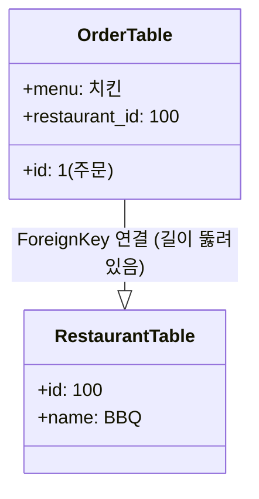

```
def get_etag(self, order):
        # ETag 생성 로직: "order-{id}-v{version}"의 해시
        raw_data = f"order-{order.id}-v{order.version}"
        return hashlib.md5(raw_data.encode()).hexdigest()
```
> get_etag : 주문 정보를 암호문(해시)으로 바꿉니다.
> "order-1-v2" -> "a1b2c3..."
> 버전(v2)이 바뀌면 암호문도 바뀝니다.

`hashlib.md5` :

> hashlib.md5는 데이터를 **"짧고 고유한 식별표(지문)"**로 압축해서, 
> 버전 관리를 쉽고 빠르고 안전하게 하기 위해 쓴 것입니다.


`self.get_object()` 는 **"URL 주소에 적힌 번호(ID)를 보고, DB에서 그 물건 하나를 찾아오는 함수

### N+1 Resolve models.py 에서 ForeignKey 썼던것 활용하기!

```
# N+1 문제 해결을 위해 select_related 사용
        if 'restaurant' in include_params and 'rider' in include_params:
            queryset = queryset.select_related('restaurant', 'rider')
        elif 'restaurant' in include_params:
            queryset = queryset.select_related('restaurant')
        elif 'rider' in include_params:
            queryset = queryset.select_related('rider')
```
> 해당 코드가 없을 때는, 주문 10개 가져올 때 식당 정보 가져오려고
> DB를 10번 더 찔러야 합니다. (1번 + 10번 = 11번 쿼리)
> select_related를 통해, SQL의 JOIN 문법을 사용해서
> **"주문 가져오는 김에 식당 정보도 옆에 붙여서 딱 1번만 가져와!"**라고 명령합니다.


### 사이드 로딩 고려

> 같은 곳에서 주문을 100번 시켰는데, 식당 이름/주소를 100번이나 보내는 건 낭비니까, "주문 목록"과 "식당 목록"을 분리해서 보내주는 >기술입니다.

```
 if 'rider' in include_params:
                rider_ids = set()
                riders = []
                for order in (page if page else queryset):
                     if order.rider and order.rider.id not in rider_ids:
                         rider_ids.add(order.rider.id)
                         riders.append({
                             "id": order.rider.id,
                             "name": order.rider.name
                         })
                included['riders'] = riders
                        
```


if - match

`status.HTTP_400_BAD_REQUEST == 400`
> BAD_REQUEST

400번이 뜨는 흔한 상황들 (다른 프로젝트)
필수 항목 누락: "아이디랑 비번 보내랬더니 아이디만 보냄" -> 400
타입 오류: "나이(숫자) 적으랬더니 '스물'이라고 한글로 적음" -> 400
JSON 문법 오류: "괄호 { 하나 빼먹고 보냄" -> 400
유효성 검사 실패: "이메일에 @가 없잖아!" -> 400


`HTTP_412_PRECONDITION_FAILED`
> 낙관적 락(Optimistic Lock) 알리는 코드입니다. 클라이언트는 412 에러를 받으면 "누군가 수정했구나. 다시 조회해서 재시도해야겠다"라고 판단합니다.

> PRECONDITION_FAILED

## 앞으로 리펙토링 해야할 코드 아직(미완) 

>  정의만 되어 있고 호출되는 곳이 없습니다. save 도 각함수내에서 함

```
    def perform_action_with_locking(self, request, action_func):
        order = self.get_object()
        
        # Optimistic Locking Check
        is_valid, error_response = self.check_etag(request, order)
        if not is_valid:
            return error_response
            
        response = action_func(request, order)
        
        # 상태가 변경되었다면 버전 증가 및 저장 (action_func 내부에서 save() 하지 말고 여기서 처리)
        # 하지만 action_func 내부 로직이 복잡할 수 있으니, 
        # action_func에서 business logic만 수행하고 여기서 save하는 패턴으로 리팩토링합니다.
        # 또는 action_func에서 save() 하고 버전을 증가시킵니다.
        
        return response
```

###  이후 코드들 @idempotent

```
 @idempotent
    @action(detail=True, methods=['post'], url_path='payment')
    def payment(self, request, pk=None):
        order = self.get_object()
        
        # ETag Check
        is_valid, error_response = self.check_etag(request, order)
        if not is_valid: return error_response

        if order.status != Order.Status.PENDING_PAYMENT:
            return Response({"error": "Invalid state"}, status=status.HTTP_400_BAD_REQUEST)
            
        order.status = Order.Status.PENDING_ACCEPTANCE
        # 버전 증가
        order.version += 1
        time.sleep(0.5)
        order.save()
        
        response = Response(OrderV2Serializer(order).data)
        response['ETag'] = f'"{self.get_etag(order)}"'
        return response
```

- @idempotent: 1차 방어선 <멱등성 고려>

- `if not is_valid: return error_response` : 2차 방어선 <낙관적 락 (동시성 고려)>

- `if order.status != Order.Status.PENDING_PAYMENT` : 3차 방어선 <상태 고려>


`response['ETag'] = f'"{self.get_etag(order)}"'` : 다음 etag 발급 


- ForeignKey를 활용한 select_related (DB 최적화)


- Side-loading 로직의 흐름 (네트워크 최적화)

```
[ 트럭 도착 ] (DB 데이터)
-------------------------------------------------------
📦 주문1 (치킨, BBQ)  
📦 주문2 (피자, BBQ) 
📦 주문3 (콜라, BHC)
-------------------------------------------------------
      ⬇️ (하나씩 꺼내서 분류 시작)

[ 공장 라인 ] (for order in pages)
-------------------------------------------------------
1. 📦 "주문1" 집어듬 -> 식당이 BBQ네?
   - 장부 확인: "BBQ 본 적 있어?" -> 아니오 (처음)
   - 행동: 
     ① [본품 상자]에 주문1 넣음
     ② [부록 상자]에 BBQ 식당 정보 넣음 (★추가)
     ③ 장부에 "BBQ" 기록

2. 📦 "주문2" 집어듬 -> 식당이 BBQ네?
   - 장부 확인: "BBQ 본 적 있어?" -> 네 (아까 봄)
   - 행동:
     ① [본품 상자]에 주문2 넣음
     ② [부록 상자]는 건너뜀 (이미 있으니까! 🗑️중복제거)

3. 📦 "주문3" 집어듬 -> 식당이 BHC네?
   - 장부 확인: "BHC 본 적 있어?" -> 아니오 (처음)
   - 행동:
     ① [본품 상자]에 주문3 넣음
     ② [부록 상자]에 BHC 식당 정보 넣음 (★추가)
     ③ 장부에 "BHC" 기록
-------------------------------------------------------
      ⬇️ (포장 완료)

[ 최종 택배 상자 ] (Response JSON)
+-----------------------------------------------------+
|  "results": [                                       |
|     { 주문1 (식당ID: 100) },                        |
|     { 주문2 (식당ID: 100) },                        |
|     { 주문3 (식당ID: 101) }                         |
|  ],                                                 |
|                                                     |
|  "included": {                                      |
|     "restaurants": [                                |
|        { 식당 100 (BBQ 정보...) },                  |
|        { 식당 101 (BHC 정보...) }                   |
|     ]                                               |
|  }                                                  |
+-----------------------------------------------------+
```
---
같이 보기~~

**kwargs (나머지 잡동사니 - 딕셔너리) -> 아주 중요!
의미: "Keyword Arguments"의 줄임말입니다. 이름표가 붙은 인자들을 딕셔너리로 묶어줍니다.
DRF에서 핵심 용도: URL에서 뽑아낸 변수가 여기 들어옵니다.
URL 설정: /orders/<int:pk>/ (주문 번호를 pk라고 부르자!)
실제 요청: /orders/10/
결과: kwargs = {'pk': 10}


response['ETag'] = f'"{self.get_etag(instance)}"'
        return response

response['ETag'] 키

f'"{self.get_etag(instance)}"' value 
' ' 안에 "abc" 이렇게 표기되어야함


queryset = self.filter_queryset(self.get_queryset())  : 아무기능 못함

. 
(page, many=True)
 - 소식가
상황: 페이지네이션이 성공했을 때 (if page is not None).
재료: page 변수 안에는 딱 20개 (한 페이지 분량)의 주문만 들어있습니다.
결과: 시리얼라이저는 20개만 변환하면 됩니다. 빠르고 가볍습니다.
2. 
(queryset, many=True)
 - 대식가
상황: 페이지네이션 설정이 없거나 실패했을 때 (else).
재료: queryset 변수 안에는 1,000개 (전체 데이터)의 주문이 몽땅 들어있습니다.
결과: 시리얼라이저는 1,000개를 전부 변환해야 합니다. 성능에 부담이 갈 수 있습니다.


---

 @action(detail=True, methods=['post'], url_path='payment')
```
@action(detail=True, methods=['post'], url_path='payment')
1. detail=True (대상 범위)
True: **"주문 하나하나(개별)"**에 대한 행동입니다.
URL 모양: /orders/10/payment/ (10번 주문을 결제해라)
의미: "특정 주문 번호(ID)가 필요해!"
False: **"주문 전체(목록)"**에 대한 행동입니다.
URL 모양: /orders/recent_list/ (최근 주문 목록을 보여줘라)
의미: "ID 필요 없어, 전체 관리 차원이니까."
2. methods=['post'] (행동 방식)
이 주소로 들어올 때 허용할 HTTP 메서드를 정합니다.
['post']: 결제는 데이터를 생성/확정하는 중요한 행위이므로 POST만 허용합니다. GET으로 접근하면 "너 방법 틀렸어(405 Error)"라고 쫓아냅니다.
['get', 'post'] 처럼 여러 개를 허용할 수도 있습니다.
3. url_path='payment' (주소 이름)
URL의 꼬리 부분에 붙을 별명입니다.
/orders/{id}/payment/ ← 바로 이 부분!
만약 이걸 안 적으면? 함수 이름(def payment)을 그대로 갖다 씁니다.
```
