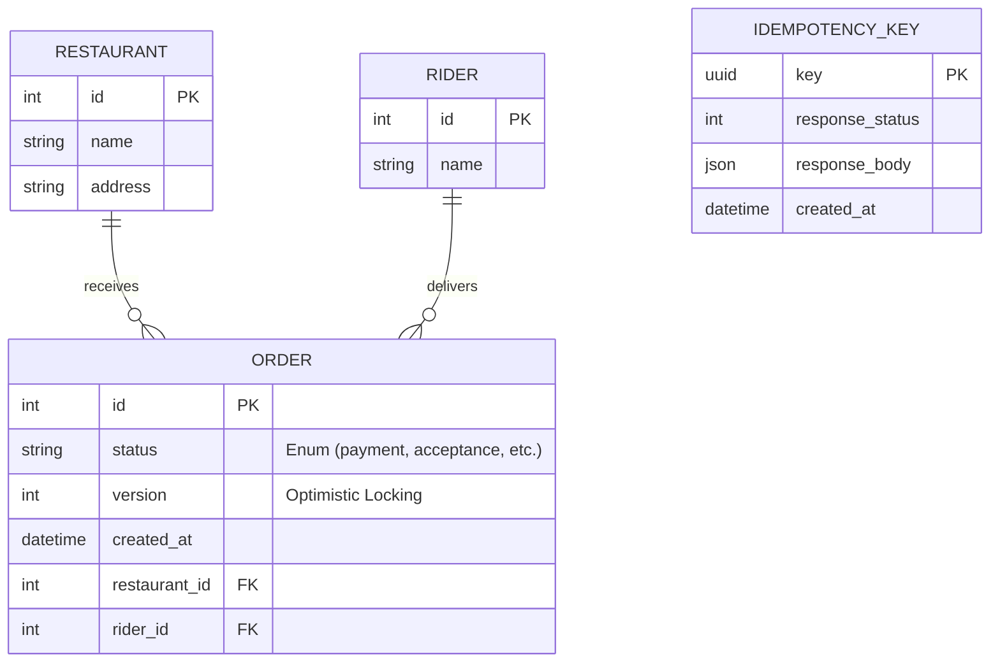
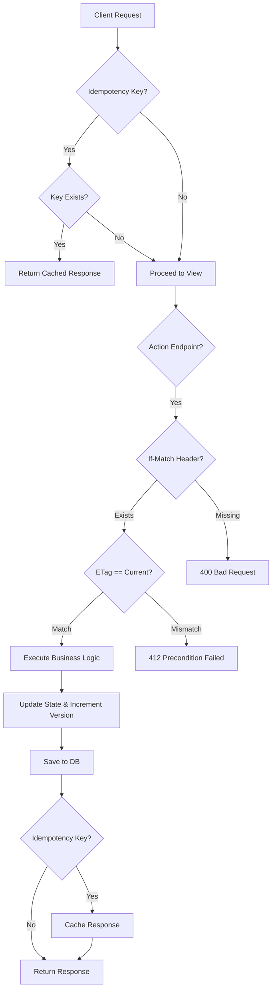
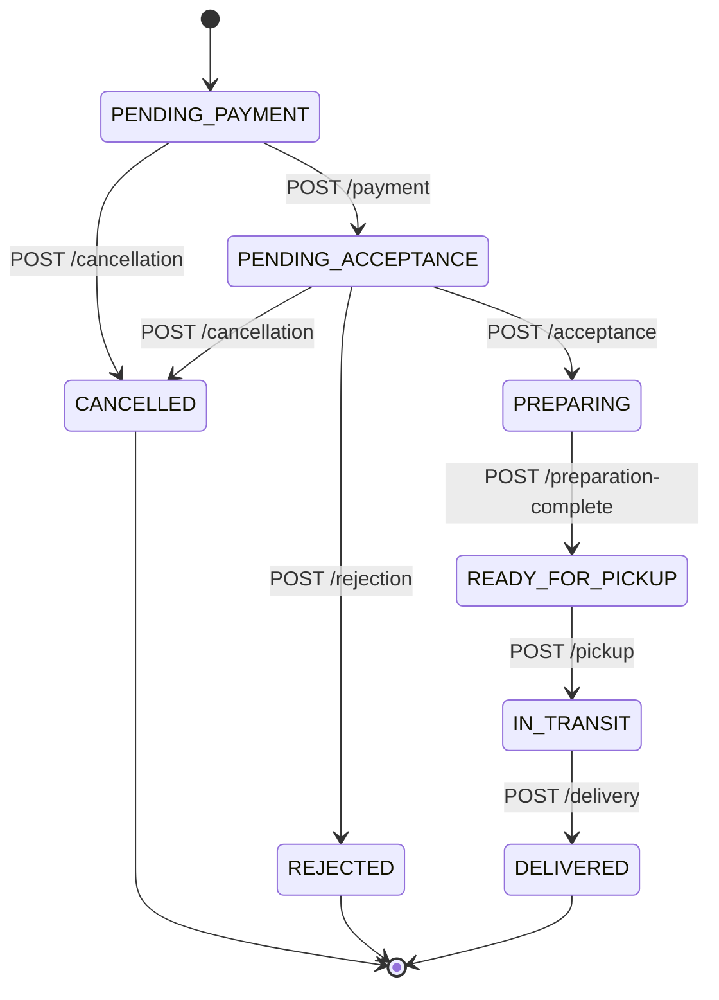
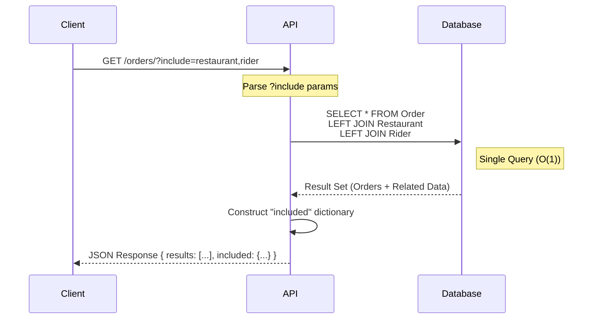

# QuickEats V2 System Architecture

This document provides a visual overview of the refactored QuickEats V2 API architecture, focusing on the new patterns implemented: Action-oriented Resources, Optimistic Locking, Idempotency, and Side-loading.

## 1. Database Schema (ER Diagram)

The `Order` model is the central entity, now linked to `Restaurant` and `Rider` to solve the N+1 problem. `IdempotencyKey` ensures safe retries.

## 2. Request Processing Flow (Pipeline)

Every V2 POST request goes through the following pipeline. This ensures both **Consistency** (Optimistic Locking) and **Reliability** (Idempotency).

## 3. Order State Machine (V2 Lifecycle)

The V2 API enforces strict state transitions via explicit Action Endpoints.

## 4. N+1 Problem Solution (Side-loading)

The `list` endpoint optimizes data fetching using `select_related` and returns a compound document.

